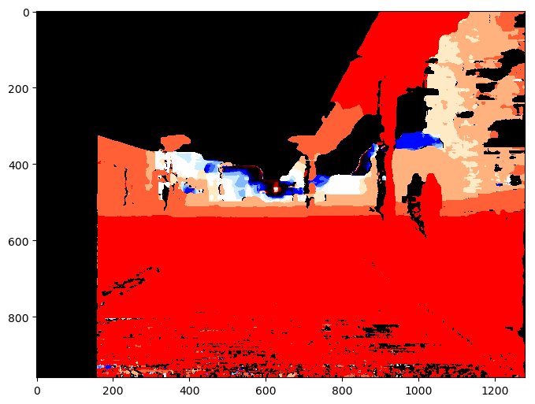
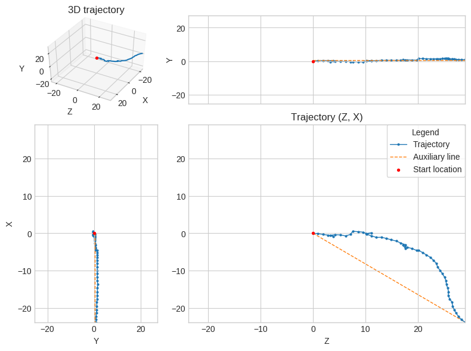
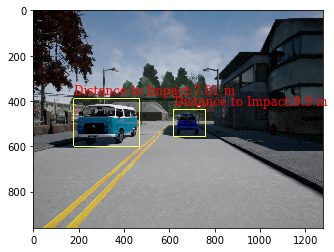
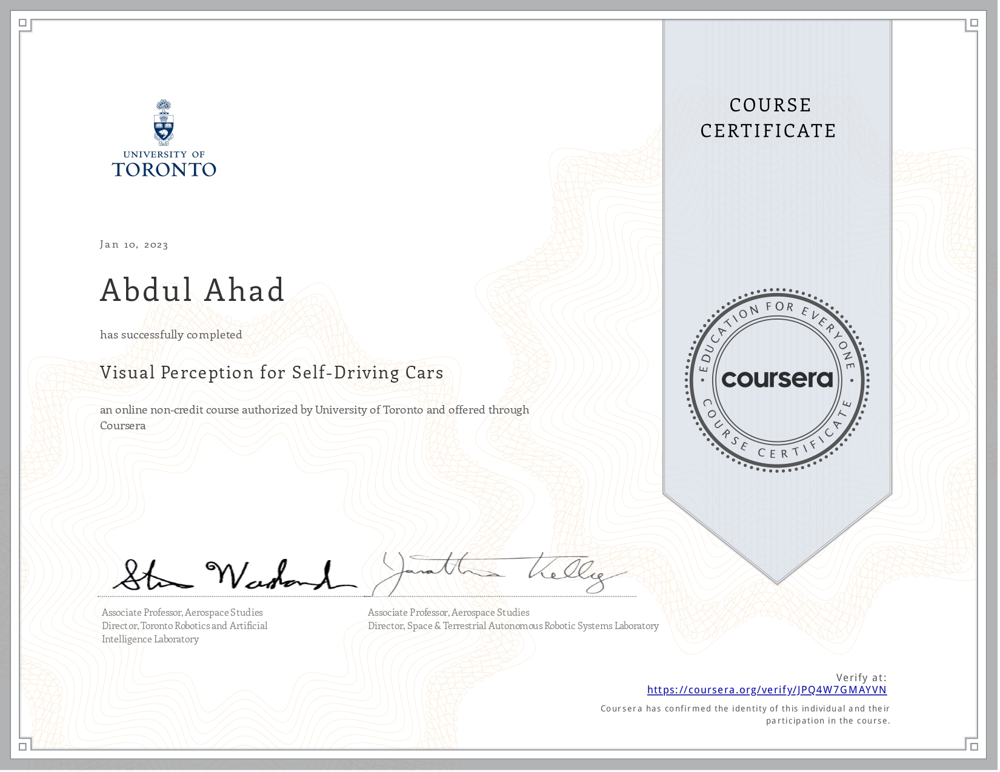

# Visual Perception for self driving cars - Solutions

This repository contain the solutions for the programming assignments of the course, Visual percepetion for selfdriving' cars taught by the University of Toronto.

Following is a basic summary of the weekly concepts and assignments.

## Week 1:  
 - Introduction to the camera projection model.
    - Important points to note
        - Camera matrix : The matrix consisting of the the camera intrinsics like focal length and centre of camera
        - Transformation matrix : The matrix consisting of the Rotation and translation between camera cordinates and world cordinates
        - Projection matrix : A matrix which converts the points from 3D world cordinates to 2D camera image cordinates. It is a combination of the Transformation and Camera matrices
 - Stereo setup:
    - The monocular setup leads to loss of depth. Hence we use two cameras to estimate depth of a scene
    - In stereo vision, disparity refers to the difference in the position of a feature in the left and right images of a stereo camera.  
    - If we know disparity D,and the baseline b, we can estimate the depth Z as,  
    Z = f*b/D

 - Pixel matching:
    - For various computer vision applications like template matching or disparity calculation we need to match pixels between corresponding frames.
    - Some common pixel matching metrics are SAD (Absolute distance), SSD (Squared Distance) or Maximum Corelation

 - Assignment:
    - The assignment implements week1 concepts into a scenario to estimate disparity and compute the depth map of an image
    - Implement a maximum corelation based template matching algorithm to detect a bike in the image.
    - Use the output from depth map to estimate the minimum distance to the bike



## Week 2

- Introduction to features:
    - Features are distinguishable and unique features in an image.
    - Feature selection and identification is an important task for many algorithms like visual odometry, localization etc.

- Feature Detector:
    - Algorithms that are able to features and their location in a given image.
    - FAST, Harris-Detector, ORB

- Feature Descriptor:
    - Algorithms that are able to assign numeric description to the features detected.
    - BRIEF, ORB

- Assignment:
    -This weeks assignment was focussed on implementing visual odometry over a driving scenario.
    - We are given a set of images, depth image and camera matrix
    - The program flow is as follow :
     ```
     1. Detect keypoints and descriptions for each feature in the image (Used ORB for this)

     2. Use feature matcher algorithm to find the closest matches between the given keypoints from two corresponding frames. (Used FLANN feature matcher)

     3. Filter out ambiguities using a minimum threshold value.

     4. Find the essential matrix from the filtered matches.

     5. Use Essential matrix decomposition to remove generate the corresponding rotation matrix and translation vector between the frames

     6. Append all these transformations together to get the final transformation matrix

     7. The transformation matrix can be split to get the odometry data wrt to camera frame.

     ```

## Week 3 - 6

- Introduction to neural networks and in particular convolutional neural nets.
- The prime area of focus was how conv nets are able to identify simple and very complex features from image data on their own
- Object Detection :
  - Object detection is the task of classifiying entities in an image and localizing it within an image
  - Some algorithms like Faster RCNN were discussed
    - In faster RCNN the region proposal and image classification are all done in a single convnet
    - Min-Max suppression is used to avoid multiple bounding boxes for the same object
    - IOU - Intersection Over Union is an important metric for bounding box evaluation. It calculates the ratio of area of intersection of the predicted BB and ground truth to the total area of the boxes. The IOU is the matched against a threshold.
    - The quality of the object detection algorithm is evaluated using two parameters:
      - Precision : It measures how many of the predicted bounding boxes are actually correct precision
      - Recall : It measures how many of the bounding boxes were actually predicted wrt to the total number of boxes.  
         
- Image Segmentaion:
  - In this each pixel in the image is assigned a class score.

- Assignment:
  - The final assignment was to estimate drivable space estimation by combining the outputs from object detection and image segmentation , and use conventional image processing algorithms to tune the output.

```
1. Estimate the 3D cordinates of every pixel in the image. 
2. From the image segmentation output a mask of the road was made.
3. Use the mask to get the pixels of road image and find a plane model using RANSAC.
4. To find lane boundaries we use a combination of segmentation out put and Canny edge detection.
5. Then we remove horizontal lines and get the line clusters.
6. The output of object detection has a low precision and a high recall so we use the segmentation output to correct for errors and estimate objects in the drivable region.
6. Finally we get the objects and the minimum distance to impact.
```
  


Thanks to Dr. Steven Waslander and the team behind the MOOC for such detailed and rich content on computer vision.

    
